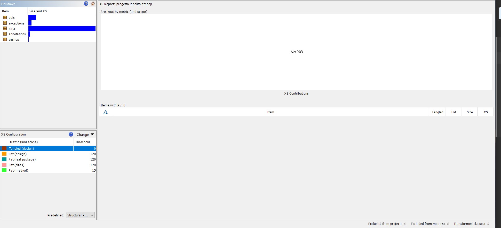

# Design assessment


```
<The goal of this document is to analyse the structure of your project, compare it with the design delivered
on April 30, discuss whether the design could be improved>
```

# Levelized structure map
```
<Applying Structure 101 to your project, version to be delivered on june 4, produce the Levelized structure map,
with all elements explosed, all dependencies, NO tangles; and report it here as a picture>
```

# Structural over complexity chart
```
<Applying Structure 101 to your project, version to be delivered on june 4, produce the structural over complexity chart; and report it here as a picture>
```


# Size metrics

```
<Report here the metrics about the size of your project, collected using Structure 101>
```

| Metric                                    | Measure |
| ----------------------------------------- | ------- |
| Packages                                  |   7      |
| Classes (outer)                           |     66    |
| Classes (all)                             |     71    |
| NI (number of bytecode instructions)      |    4697     |
| LOC (non comment non blank lines of code) |    2020     |


# Items with XS

```
<Report here information about code tangles and fat packages>
```

| Item | Tangled | Fat  | Size | XS   |
| ---- | ------- | ---- | ---- | ---- |
|  it.polito.ezshop    |   0%      |   6   |4,787      |6      |


# Package level tangles

```
<Report screen captures of the package-level tangles by opening the items in the "composition perspective" 
(double click on the tangle from the Views->Complexity page)>
```

# Summary analysis
```
<Discuss here main differences of the current structure of your project vs the design delivered on April 30>
<Discuss if the current structure shows weaknesses that should be fixed>
```
We have seen that our project structure had very high tangle (96%) due to a backward dependency involving classes of two
packages. It involves our custom java annotation to validate roles (placed in the annotations package), and the Role enum 
that we placed in the data package.
If we place the Role inside annotations (and we can because it has no dependency with anything but that annotation) 
we get a 0% tangle, so we changed our project structure to get this result and as such we attached to this document screenshots 
regarding the new project structure. As for the differences between our actual structure and the one described in the design 
document delivered on April 30, we added the EZShopControllerImpl and EZShopControllerFactory.