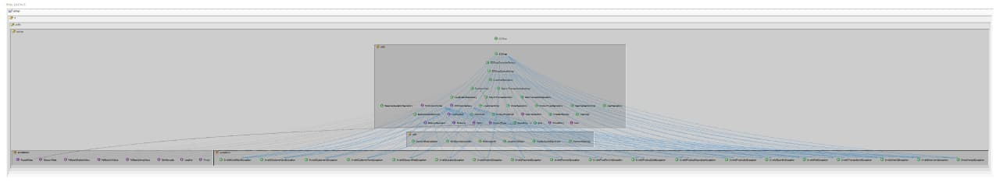
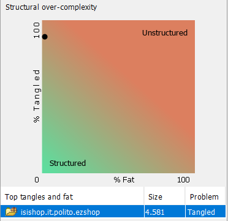
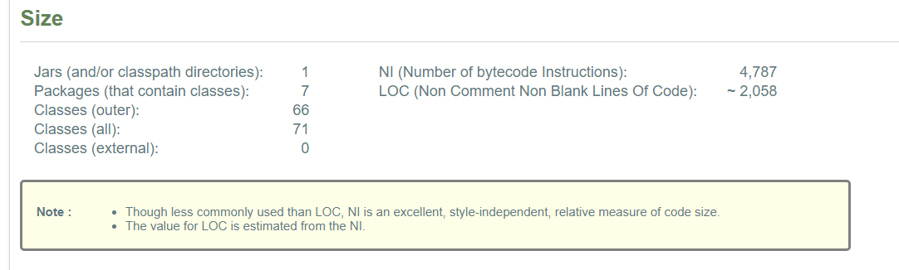
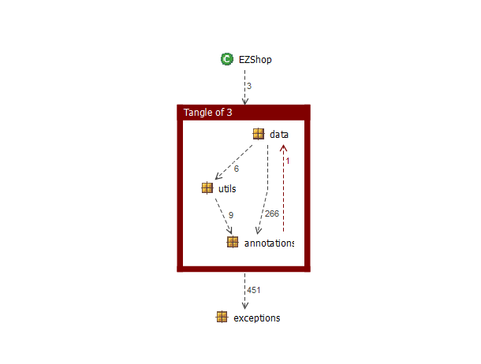
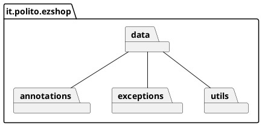
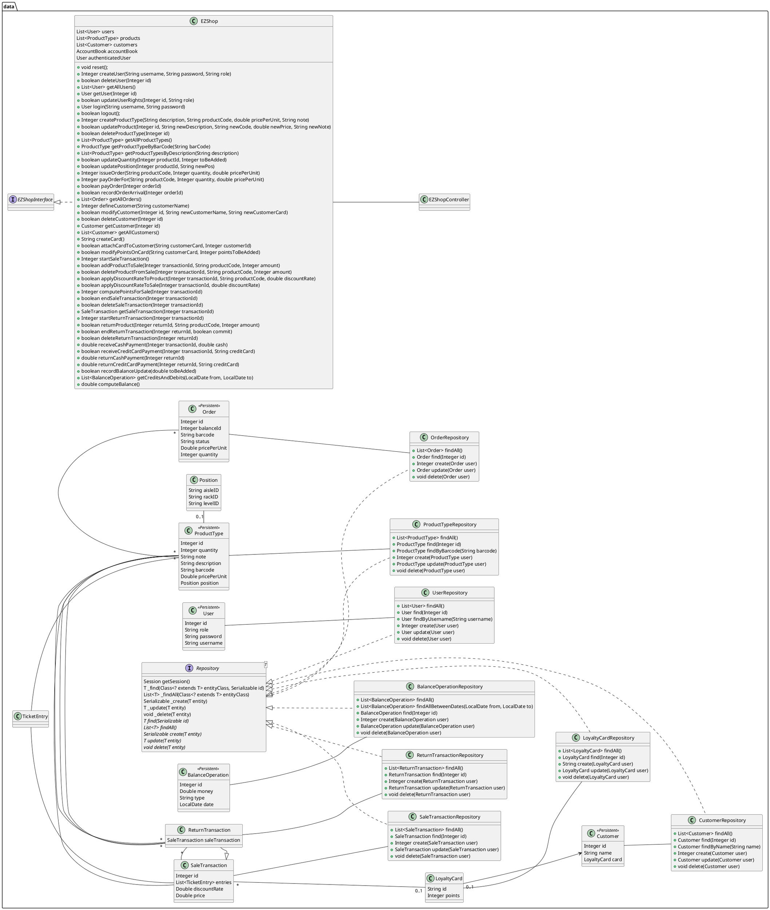
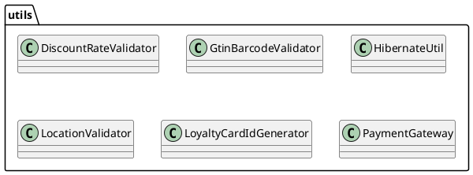
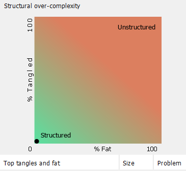

# Design assessment

The goal of this document is to analyse the structure of your project, compare it with the design delivered
on April 30, discuss whether the design could be improved

# Levelized structure map
```
<Applying Structure 101 to your project, version to be delivered on june 4, produce the Levelized structure map,
with all elements explosed, all dependencies, NO tangles; and report it here as a picture>
```

# Structural over complexity chart
```
<Applying Structure 101 to your project, version to be delivered on june 4, produce the structural over complexity chart; and report it here as a picture>
```
<div align="center">
    
</div>


# Size metrics

```
<Report here the metrics about the size of your project, collected using Structure 101>
```

| Metric                                    | Measure |
| ----------------------------------------- | ------- |
| Packages                                  |   7      |
| Classes (outer)                           |     66    |
| Classes (all)                             |     71    |
| NI (number of bytecode instructions)      |    4697     |
| LOC (non comment non blank lines of code) |    2020     |



# Items with XS

```
<Report here information about code tangles and fat packages>
```

| Item | Tangled | Fat  | Size | XS   |
| ---- | ------- | ---- | ---- | ---- |
|  it.polito.ezshop    |   0%      |   6   |4,787      |6      |


# Package level tangles

```
<Report screen captures of the package-level tangles by opening the items in the "composition perspective" 
(double click on the tangle from the Views->Complexity page)>
```

# Summary analysis
```
<Discuss here main differences of the current structure of your project vs the design delivered on April 30>
<Discuss if the current structure shows weaknesses that should be fixed>
```
## Current structure vs 30th April Design
As regards the differences between our actual structure and the one described in the `DesignDocument` delivered on April 30, we added the `EZShopController` and the `EZShopControllerFactory` to cope with the bounds of the provided interfaces and to avoid duplicating code.

Moreover, we introduced a new package `annotations` for a fancier, easily reusable and more structured validation policy which only requires to properly annotate methods and parameters to deal with exception cases. 

The new design (already provided last delivery, `DesignDocument` v2.0) looks like this


### Packages



### Low Level Design




## Weaknesses Analysis
The structure-over-complexity plot produced by structure101 shows a 96% tangle due to a backward dependency involving our custom java annotation `AcceptRoles` and the `Role` enum, placed in different packages.

Nevertheless, if we place `Role` inside the `annotations` package (and we can because it has no dependency with anything but that annotation) we get a 0% tangle, as shown below.

<div align="center">
    
</div>


Thereby we believe our design doesn't contain any related weaknesses. 
