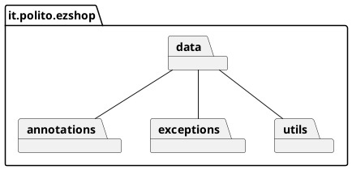
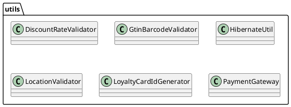
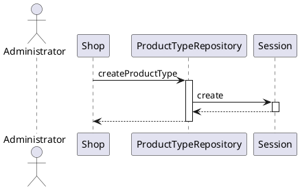
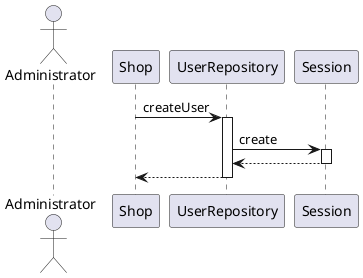
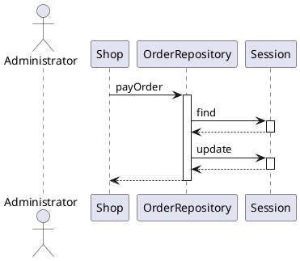
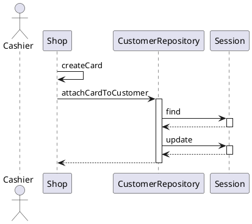
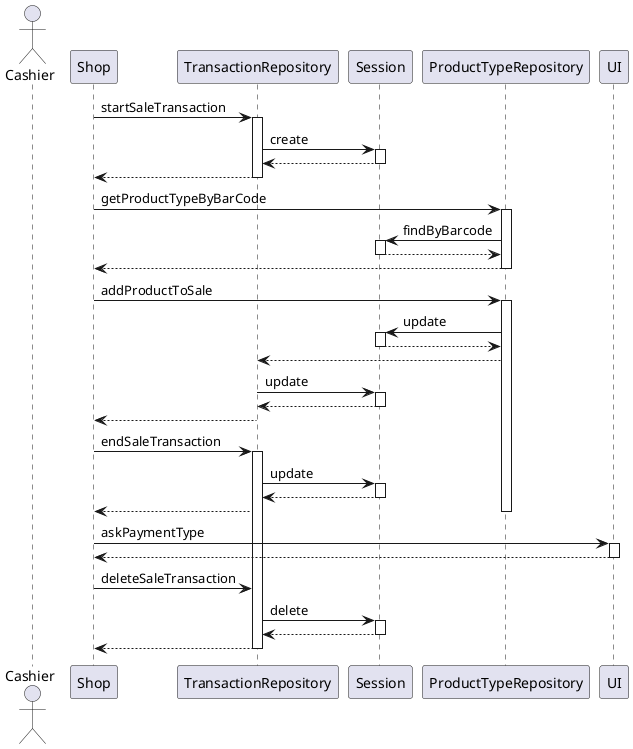
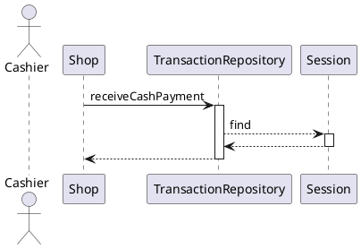
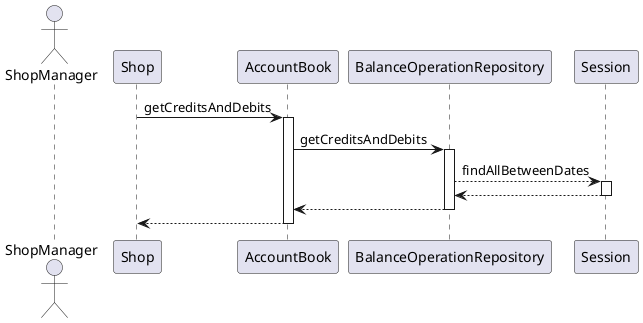

# Design Document 

Authors: Massimiliano Pronesti, Matteo Notarangelo, Davide Mammone, Umberto Pepato 

Date: 09/06/2021

Version: 2.0

# Contents

- [High level design](#package-diagram)
- [Low level design](#class-diagram)
- [Verification traceability matrix](#verification-traceability-matrix)
- [Verification sequence diagrams](#verification-sequence-diagrams)
  * [Scenario 1-1](#scenario-1-1)
  * [Scenario 2-2](#scenario-2-1)
  * [Scenario 3-2](#scenario-3-2)
  * [Scenario 4-2](#scenario-4-2)
  * [Scenario 6-5](#scenario-6-5)
  * [Scenario 7-4](#scenario-7-4)
  * [Scenario 9-1](#scenario-9-1)
# Instructions

The design must satisfy the Official Requirements document, notably functional and non-functional requirements.

# High level design 

The application follows the Repository pattern to interact with the persistence layer.

## Packages

# Low level design

```plantuml
@startuml
left to right direction

package data {

    interface EZShopInterface {
    
    }
    
    class EZShop implements EZShopInterface {
        List<User> users
        List<ProductType> products
        List<Customer> customers
        AccountBook accountBook
        User authenticatedUser
        + void reset();
        + Integer createUser(String username, String password, String role)
        + boolean deleteUser(Integer id)
        + List<User> getAllUsers()
        + User getUser(Integer id)
        + boolean updateUserRights(Integer id, String role)
        + User login(String username, String password)
        + boolean logout();
        + Integer createProductType(String description, String productCode, double pricePerUnit, String note)
        + boolean updateProduct(Integer id, String newDescription, String newCode, double newPrice, String newNote)
        + boolean deleteProductType(Integer id)
        + List<ProductType> getAllProductTypes()
        + ProductType getProductTypeByBarCode(String barCode)
        + List<ProductType> getProductTypesByDescription(String description)
        + boolean updateQuantity(Integer productId, Integer toBeAdded)
        + boolean updatePosition(Integer productId, String newPos)
        + Integer issueOrder(String productCode, Integer quantity, double pricePerUnit)
        + Integer payOrderFor(String productCode, Integer quantity, double pricePerUnit)
        + boolean payOrder(Integer orderId)
        + boolean recordOrderArrival(Integer orderId)
        + boolean recordOrderArrivalRFID(Integer orderId, String RFIDfrom)
        + List<Order> getAllOrders()
        + Integer defineCustomer(String customerName)
        + boolean modifyCustomer(Integer id, String newCustomerName, String newCustomerCard)
        + boolean deleteCustomer(Integer id)
        + Customer getCustomer(Integer id)
        + List<Customer> getAllCustomers()
        + String createCard()
        + boolean attachCardToCustomer(String customerCard, Integer customerId)
        + boolean modifyPointsOnCard(String customerCard, Integer pointsToBeAdded)
        + Integer startSaleTransaction()
        + boolean addProductToSale(Integer transactionId, String productCode, Integer amount)
        + boolean addProductToSaleRFID(Integer transactionId, String RFID)
        + boolean deleteProductFromSale(Integer transactionId, String productCode, Integer amount)
        + boolean deleteProductFromSaleRFID(Integer transactionId, String RFID)
        + boolean applyDiscountRateToProduct(Integer transactionId, String productCode, double discountRate)
        + boolean applyDiscountRateToSale(Integer transactionId, double discountRate)
        + Integer computePointsForSale(Integer transactionId)
        + boolean endSaleTransaction(Integer transactionId)
        + boolean deleteSaleTransaction(Integer transactionId)
        + SaleTransaction getSaleTransaction(Integer transactionId)
        + Integer startReturnTransaction(Integer transactionId)
        + boolean returnProduct(Integer returnId, String productCode, Integer amount)
        + boolean returnProductRFID(Integer returnId, String RFID)
        + boolean endReturnTransaction(Integer returnId, boolean commit)
        + boolean deleteReturnTransaction(Integer returnId)
        + double receiveCashPayment(Integer transactionId, double cash)
        + boolean receiveCreditCardPayment(Integer transactionId, String creditCard)
        + double returnCashPayment(Integer returnId)
        + double returnCreditCardPayment(Integer returnId, String creditCard)
        + boolean recordBalanceUpdate(double toBeAdded)
        + List<BalanceOperation> getCreditsAndDebits(LocalDate from, LocalDate to)
        + double computeBalance()
    }
    
    EZShop -- EZShopController

    interface Repository<T> {
        + Session getSession()
        + T _find(Class<? extends T> entityClass, Serializable id)
        + List<T> _findAll(Class<? extends T> entityClass)
        + Serializable _create(T entity)
        + T _update(T entity)
        + void _delete(T entity)
        + {abstract} T find(Serializable id)
        + {abstract} List<T> findAll()
        + {abstract} Serializable create(T entity)
        + {abstract} T update(T entity)
        + {abstract} void delete(T entity)
    }

    class User <<Persistent>> {
        Integer id
        String role
        String password
        String username
    }

    class UserRepository implements Repository {
        + List<User> findAll()
        + User find(Integer id)
        + User findByUsername(String username)
        + Integer create(User user)
        + User update(User user)
        + void delete(User user)
    }

    User -- UserRepository

    class Customer <<Persistent>> {
        Integer id
        String name
        LoyaltyCard card
    }

    class CustomerRepository implements Repository {
        + List<Customer> findAll()
        + Customer find(Integer id)
        + Customer findByName(String name)
        + Integer create(Customer user)
        + Customer update(Customer user)
        + void delete(Customer user)
    }

    Customer -- CustomerRepository

    class BalanceOperation <<Persistent>> {
        Integer id
        Double money
        String type
        LocalDate date
    }

    class BalanceOperationRepository implements Repository {
        + List<BalanceOperation> findAll()
        + List<BalanceOperation> findAllBetweenDates(LocalDate from, LocalDate to)
        + BalanceOperation find(Integer id)
        + Integer create(BalanceOperation user)
        + BalanceOperation update(BalanceOperation user)
        + void delete(BalanceOperation user)
    }

    BalanceOperation -- BalanceOperationRepository

    class LoyaltyCard {
        String id
        Integer points
    }

    class LoyaltyCardRepository implements Repository {
        + List<LoyaltyCard> findAll()
        + LoyaltyCard find(Integer id)
        + String create(LoyaltyCard user)
        + LoyaltyCard update(LoyaltyCard user)
        + void delete(LoyaltyCard user)
    }

    LoyaltyCard -- LoyaltyCardRepository

    class Order <<Persistent>> {
        Integer id
        Integer balanceId
        String barcode
        String status
        Double pricePerUnit
        Integer quantity
    }

    class OrderRepository implements Repository {
        + List<Order> findAll()
        + Order find(Integer id)
        + Integer create(Order user)
        + Order update(Order user)
        + void delete(Order user)
    }

    Order -- OrderRepository

    class ProductType <<Persistent>> {
       Integer id
       Integer quantity
       String note
       String description
       String barcode
       Double pricePerUnit
       Position position
    }

    class Product <<Persistent>> {
        String id
       ProductTypeImpl productType
       Status status
    }

    class ProductRepository implements Repository {
        + Product find(Serializable id)
        + List<Product> findAll() 
        + String create(Product product)
        + Product update(Product product)
        + void delete(Product product)
    }

    class ProductTypeRepository implements Repository {
        + List<ProductType> findAll()
        + ProductType find(Integer id)
        + ProductType findByBarcode(String barcode)
        + Integer create(ProductType user)
        + ProductType update(ProductType user)
        + void delete(ProductType user)
    }
    Product -- ProductRepository
    ProductType -- "*" Product
    ProductType -- ProductTypeRepository

    class Position {
        String aisleID
        String rackID
        String levelID
    }

    class SaleTransactionRepository implements Repository {
        + List<SaleTransaction> findAll()
        + SaleTransaction find(Integer id)
        + Integer create(SaleTransaction user)
        + SaleTransaction update(SaleTransaction user)
        + void delete(SaleTransaction user)
    }

    class SaleTransaction {
        Integer id
        List<TicketEntry> entries
        Double discountRate
        Double price
    }
    
    class ReturnTransaction extends SaleTransaction {
        SaleTransaction saleTransaction
    }

    SaleTransaction -- SaleTransactionRepository
    SaleTransaction -- "*" Product
    
    class ReturnTransactionRepository implements Repository {
        + List<ReturnTransaction> findAll()
        + ReturnTransaction find(Integer id)
        + Integer create(ReturnTransaction user)
        + ReturnTransaction update(ReturnTransaction user)
        + void delete(ReturnTransaction user)
    }
    
    ReturnTransaction -- ReturnTransactionRepository

    Order "*" - ProductType

    SaleTransaction - "*" ProductType
    ReturnTransaction - "*" ProductType

    LoyaltyCard "0..1" --> Customer

    SaleTransaction "*" -- "0..1" LoyaltyCard

    ProductType - "0..1" Position

    ReturnTransaction "*" - SaleTransaction

    TicketEntry -- SaleTransaction
    TicketEntry -- ProductType
}

@enduml
```

# Verification traceability matrix

| FR Code | PaymentGateway | CustomerRepository | BalanceOperationRepository | LoyalityCard | OrderRepository | ProductTypeRepository|Position|TransactionRepository|TicketEntry| EZShop | UserRepository |
| :--------:|:-----------:|:---------:|:----------------:| :---------------: | :------: | :--------: |:---:|:-----------:|:---------:|:----------------:| :--------: |
| FR1   | | | |   |   |   | | | |  X |X| 
| FR3   | | | |   |   | X | | | |  X | |  
| FR4   | | | |   | X | X |X|X| |  X | |  
| FR5   | |X| | X |   |   | | | |  X | |  
| FR6   | | | | X |   | X | |X|X|  X | |  
| FR7   |X| | |   |   |   | | |X|  X | | 
| FR8   | | |X|   |   |   | | | |  X | |  

# Verification sequence diagrams

## Scenario 1-1

## Scenario 2-1

## Scenario 3-2

## Scenario 4-2

## Scenario 6-5

## Scenario 7-4

## Scenario 9-1

