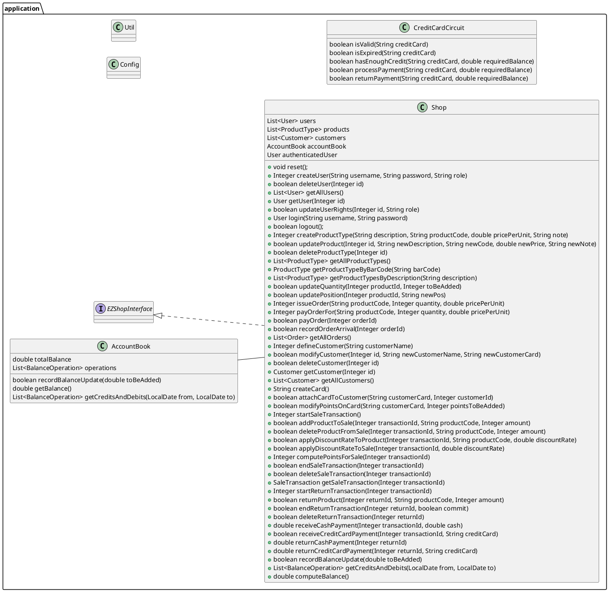
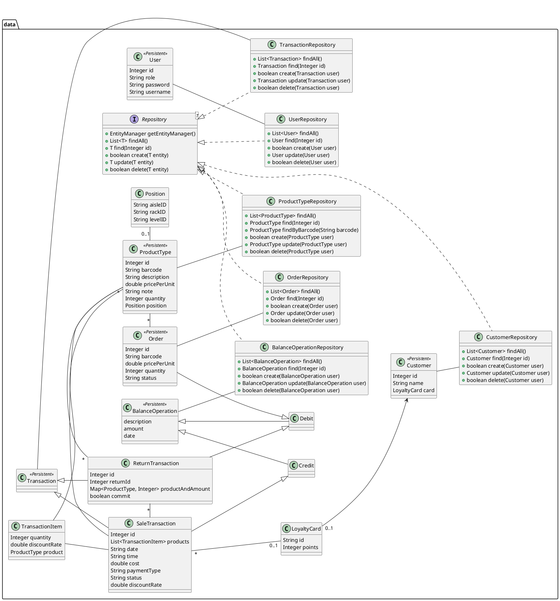
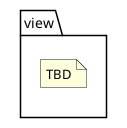
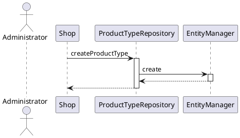
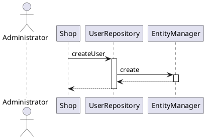
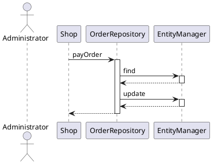
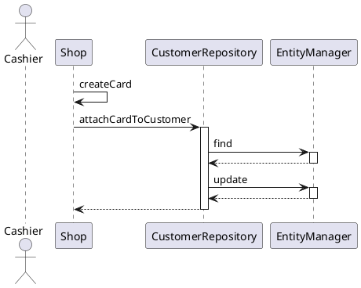
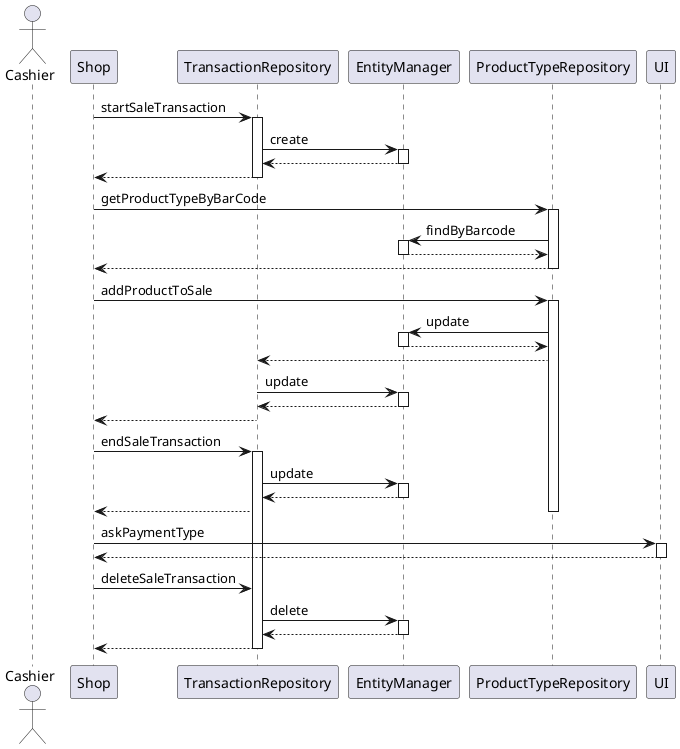
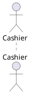
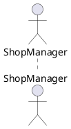

# Design Document 

Authors: Massimiliano Pronesti, Matteo Notarangelo, Davide Mammone, Umberto Pepato 

Date: 30/04/2021

Version: 1.0

# Contents

- [High level design](#package-diagram)
- [Low level design](#class-diagram)
- [Verification traceability matrix](#verification-traceability-matrix)
- [Verification sequence diagrams](#verification-sequence-diagrams)

# Instructions

The design must satisfy the Official Requirements document, notably functional and non functional requirements

# High level design 

The application follows the 3-tier architectural pattern, with each entity having a dedicated `Repository` to interact
with the persistence layer. The Data layer interacts with the repositories to execute collection-related actions, the
View layer with the Java UI library and the Application layer accepts inputs from the UI and converts them to data model
actions.

## Packages

# Low level design

# Verification traceability matrix

| FR Code | AccountBook | CreditCardCircuit | CustomerRepository | BalanceOperationRepository | LoyalityCard | OrderRepository | ProductTypeRepository|Position|TransactionRepository|TransactionItem| Shop | UserRepository |
| :--------:|:---:|:-----------:|:---------:|:----------------:| :---------------: | :------: | :--------: |:---:|:-----------:|:---------:|:----------------:| :--------: |
| FR1   | | | | |   |   |   | | | |  X |X| 
| FR3   | | | | |   |   | X | | | |  X | |  
| FR4   | | | | |   | X | X |X|X| |  X | |  
| FR5   | | |X| | X |   |   | | | |  X | |  
| FR6   | | | | | X |   | X | |X|X|  X | |  
| FR7   | |X| | |   |   |   | | |X|  X | | 
| FR8   |X| | |X|   |   |   | | | |  X | |  

# Verification sequence diagrams

## Scenario 1-1

## Scenario 2-1

## Scenario 3-2

## Scenario 4-2

## Scenario 6-5

## Scenario 7-4

## Scenario 9-1

