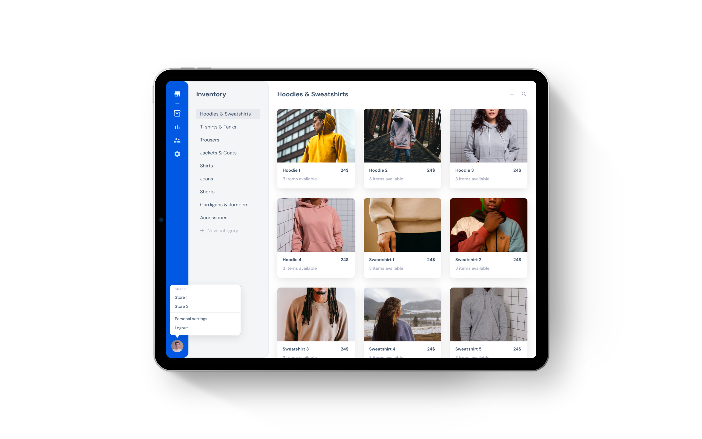

# Graphical User Interface Prototype

Authors: Massimiliano Pronesti, Matteo Notarangelo, Davide Mammone, Umberto Pepato

Date: 21/04/2021

Version:

## Interactive mockup

The interactive version of our Figma prototype is
available [here](https://www.figma.com/proto/ynbqD6Eqx0cJp2qFGirOLr/SoftEng-Project?page-id=0%3A1&node-id=9%3A48&viewport=453%2C208%2C0.05524108558893204&scaling=scale-down)
.

## Authentication

The user is greeted by some minimal authentication interfaces. A tap on "Sign in" brings to the first logged-in page:
[Inventory](#inventory-management).

## Inventory management

Inventory - as well as other main areas of the app - uses a master/detail architecture, grouping the products by
category. Products are organized in a scrollable grid of cards, which once clicked bring to the item editing interface,
shown below.

## Sale receipts

Sale receipts can be created either by scanning items with an external barcode scanner or by searching products on the
right and tapping one or more times on them. To remove products, a swipe to delete action is used
(as showcased below).

## Bookkeeping

The bookkeeping pages organizes sales and expenses in data tables with search functionality.

## Customers

Data tables are used in the Customers interface as well.

## Store settings

The store settings pages allow the manager to edit data about the store as well as to add remove users
and update their roles.

## Settings

A press on the user icon opens an overlay menu which allows to quickly switch between stores, open the user preferences
or logout.

### Licensing

All assets used in the GUI prototype are licensed for commercial or non-commercial use, see:

- [Material Icons](https://github.com/google/material-design-icons/blob/master/LICENSE)
- [Unsplash](https://unsplash.com/license)
- [Pexels](https://www.pexels.com/license/)
- [Vecteezy](https://www.vecteezy.com/free-vector/robot)
