# Graphical User Interface Prototype  

Authors: Massimiliano Pronesti, Matteo Notarangelo, Davide Mammone, Umberto Pepato

Date: 21/04/2021

Version:

## Interactive mockup

The interactive version of our Figma prototype is available [here](https://www.figma.com/proto/ynbqD6Eqx0cJp2qFGirOLr/SoftEng-Project?page-id=0%3A1&node-id=9%3A48&viewport=453%2C208%2C0.05524108558893204&scaling=scale-down).

## Authentication
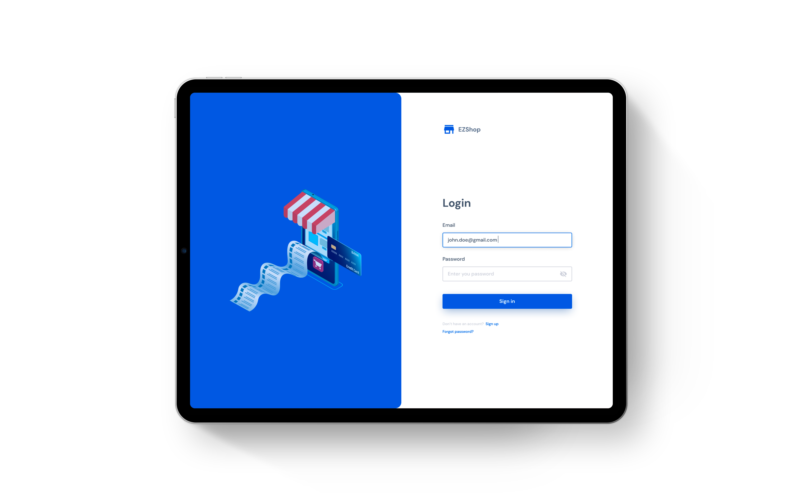
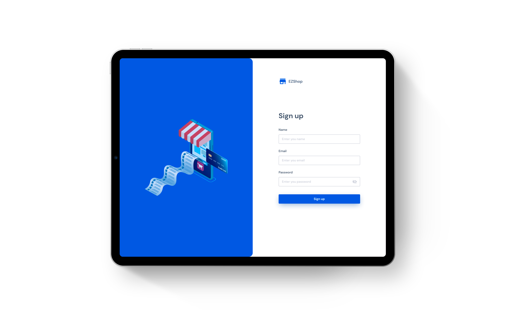

## Inventory management
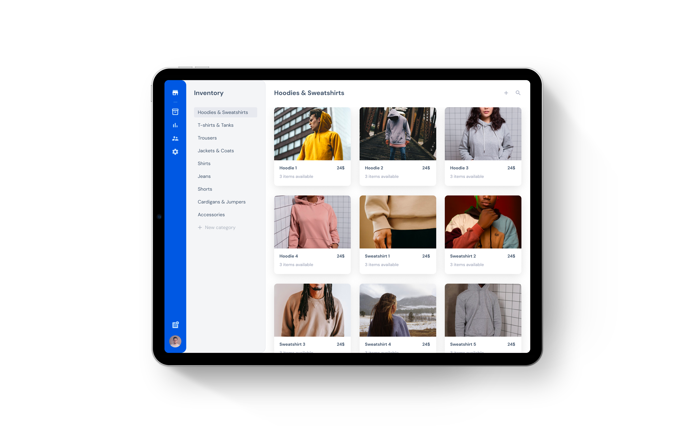
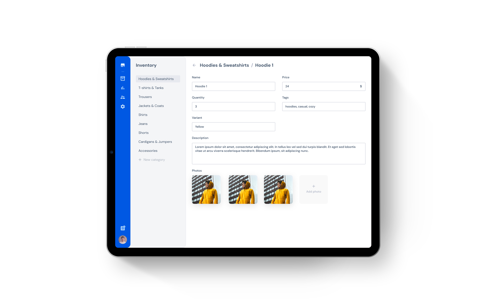

## Sale receipts
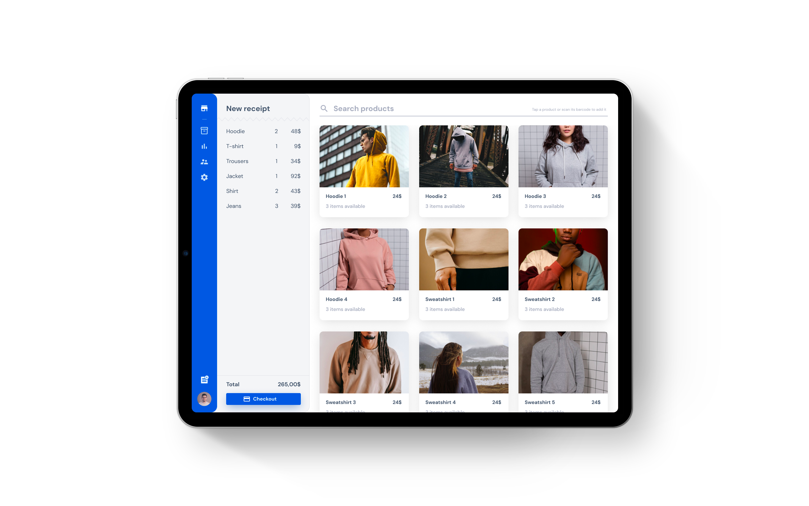
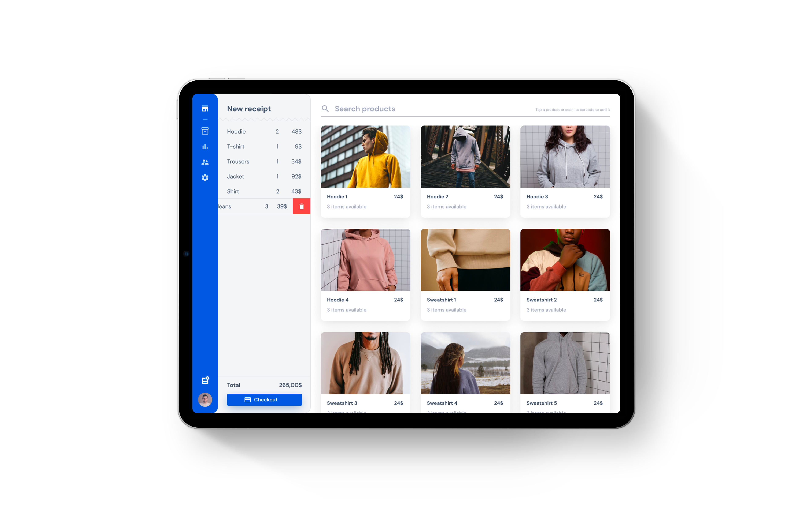

## Bookkeeping
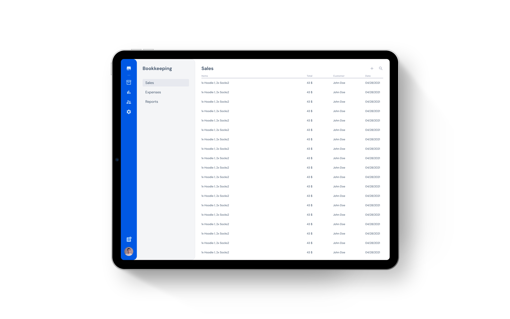

## Customers
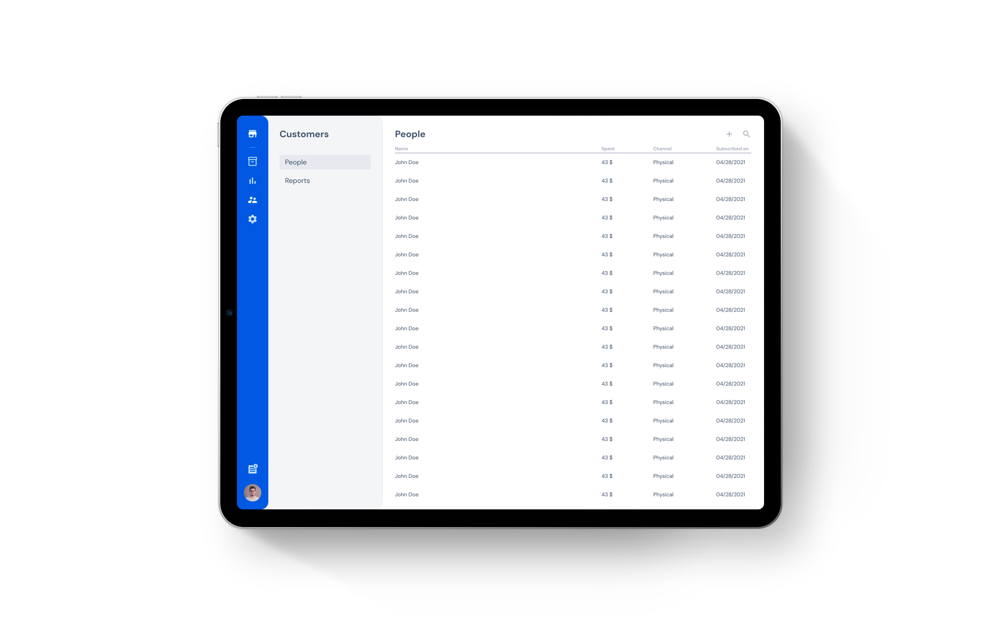

## Store settings
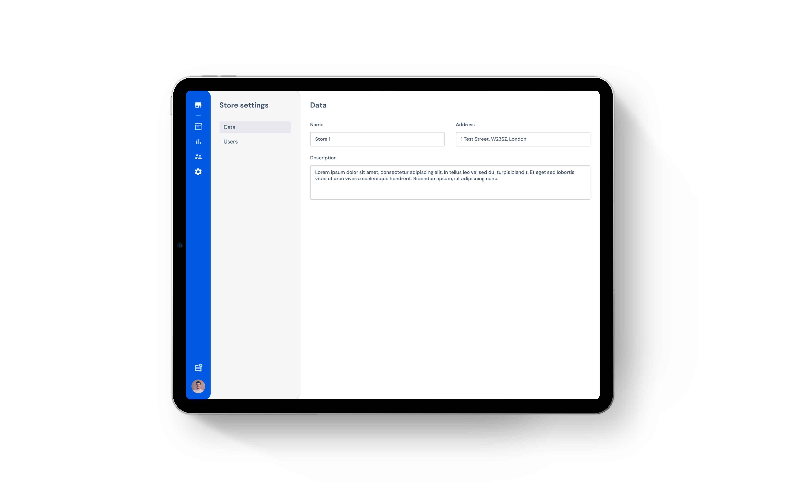
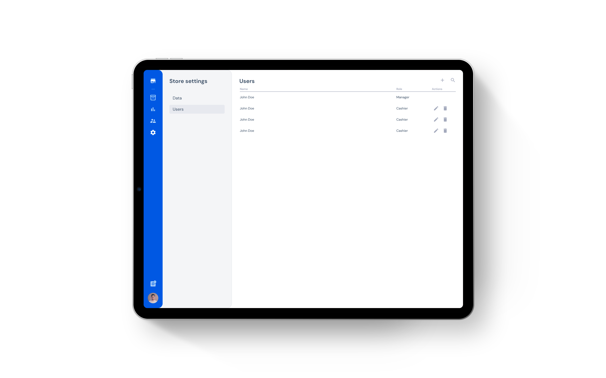

## Settings
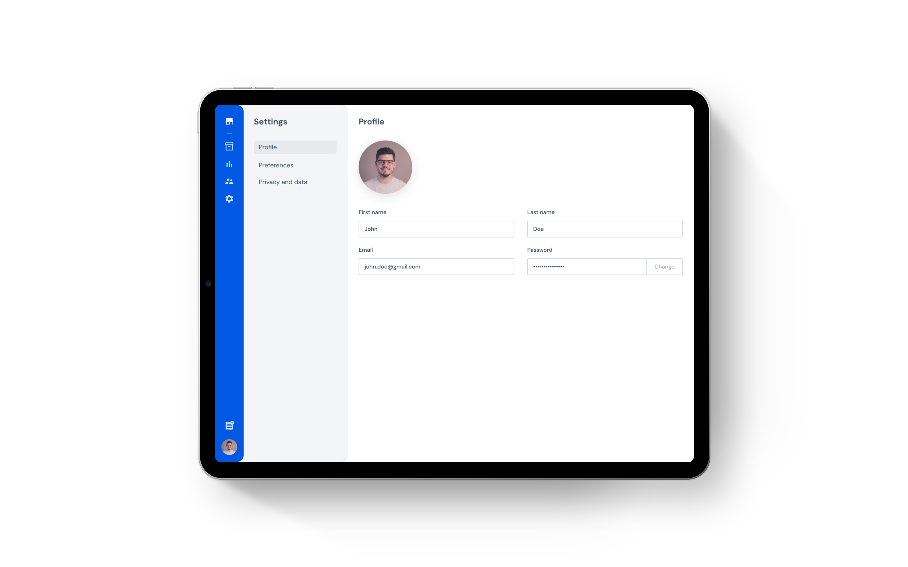

### Licensing

All assets used in the GUI prototype are licensed for commercial or non-commercial use, see:

- [Material Icons](https://github.com/google/material-design-icons/blob/master/LICENSE)
- [Unsplash](https://unsplash.com/license)
- [Pexels](https://www.pexels.com/license/)
- [Vecteezy](https://www.vecteezy.com/free-vector/robot)
