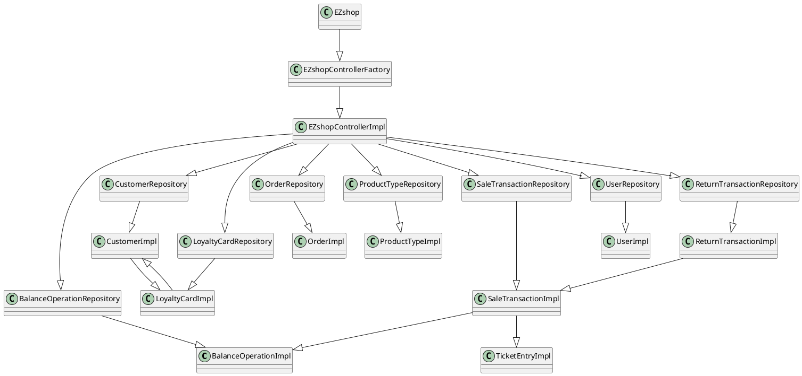

# Integration and API Test Documentation

Authors: Massimiliano Pronesti, Matteo Notarangelo, Davide Mammone, Umberto Pepato

Date: 22/05/2021

Version: 1.0

# Contents

- [Dependency graph](#dependency graph)

- [Integration approach](#integration)

- [Tests](#tests)

- [Scenarios](#scenarios)

- [Coverage of scenarios and FR](#scenario-coverage)
- [Coverage of non-functional requirements](#nfr-coverage)


# Dependency graph 



# Integration approach
A bottom-up approach was adopted. To solve the circular dependency involving ```LoyaltyCardImpl``` and ```CustomerImpl```, we chose to treat this specific case as a unique system to be tested simultaneously.

## Sequence
|Step#|Classes|
|-----|-------|
|Step1|LoyaltyCardImpl+BalanceOperationImpl+OrderImpl+ProductTypeImpl+TicketEntryImpl+UserImpl|
|Step2|CustomerImpl+SaleTransactionImpl|
|Step3|ReturnTransactionImpl|
|Step4|BalanceOperationRepository+CustomerRepository+LoyaltyCardRepository+OrderRepository+ProductTypeRepository+ReturnTransactionRepository+SaleTransactionRepository+UserRepository|
|Step5|EZShopControllerImpl|
|Step6|EZShopControllerFactory|
|Step7|EZshop|


#  Tests

## Step 1
| Classes  | JUnit test cases | 
| ------------- |:-------------:|
|LoyaltyCardImpl|it.polito.ezshop.data.LoyaltyCardTest|
|BalanceOperationImpl|it.polito.ezshop.data.BalanceOperationTest|
|OrderImpl|it.polito.ezshop.data.OrderTest|
|ProductTypeImpl|it.polito.ezshop.data.ProductTypeTest|
|TicketEntryImpl|it.polito.ezshop.data.TicketEntryTest|
|UserImpl|it.polito.ezshop.data.UserTest|


## Step 2
| Classes  | JUnit test cases |
| ------------- |:-------------:|
|CustomerImpl|it.polito.ezshop.data.CustomerTest|
|SaleTransactionImpl|it.polito.ezshop.data.SaleTransactionTest|


## Step 3
| Classes  | JUnit test cases |
| ------------- |:-------------:|
|ReturnTransactionImpl|it.polito.ezshop.data.ReturnTransactionImpl|


## Step 4
| Classes  | JUnit test cases |
| ------------- |:-------------:|
|BalanceOperationRepository|it.polito.ezshop.data.BalanceOperationRepositoryTest|
|CustomerRepository|it.polito.ezshop.data.CustomerRepositoryTest|
|LoyaltyCardRepository|it.polito.ezshop.data.LoyaltyCardRepositoryTest|
|OrderRepository|it.polito.ezshop.data.OrderRepositoryTest|
|ProductTypeRepository|it.polito.ezshop.data.ProductTypeRepositoryTest|
|ReturnTransactionRepository|it.polito.ezshop.data.ReturnTransactionRepositoryTest|
|SaleTransactionRepository|it.polito.ezshop.data.SaleTransactionRepositoryTest|
|UserRepository|it.polito.ezshop.data.UserRepositoryTest|


## Step 5
| Classes  | JUnit test cases |
| ------------- |:-------------:|
|EZShopControllerImpl|*|


## Step 6
| Classes  | JUnit test cases |
| ------------- |:-------------:|
|EZShopControllerFactory|it.polito.ezshop.data.EZShopControllerFactory|


## Step 7
| Classes  | JUnit test cases |
| ------------- |:-------------:|
|EZShop| it.polito.ezshop.data.EZShopTest|

**Notice:** Since ```EZShop``` only calls ```EZShopControllerImpl``` methods, we chose not to duplicate the testcases.  

# Scenarios


##### Scenario 2-4

| Scenario       | List all users                       |
| -------------- | ------------------------------------ |
| Precondition   | Admin A exists and is logged in      |
|                | A certain number X of account exists |
| Post condition | a list of X account is displayed     |
| Step#          | Description                          |
| 1              | A selects the list of all the users  |
| 3              | a list of X account is displayed     |


##### Scenario 3-4

| Scenario       | Delete a product type                 |
| -------------- | ------------------------------------- |
| Precondition   | ShopManager S exists and is logged in |
|                | Product type X exists                 |
| Post condition | Product type X has been deleted       |
|                | Balance not changed                   |
|                | X.units not changed                   |
| Step#          | Description                           |
| 1              | S searches X                          |
| 1              | S deletes X                           |


##### Scenario 3-5

| Scenario       | List all product type                     |
| -------------- | ----------------------------------------- |
| Precondition   | ShopManager S exists and is logged in     |
|                | A certain number X of Product type exists |
| Post condition | a list of X Product type is displayed     |
| Step#          | Description                               |
| 1              | A selects the list of all the productType |
| 1              | a list of X Product type is displayed     |


# Coverage of Scenarios and FR


| Scenario ID | Functional Requirements covered | JUnit  Test(s) |
| ----------- | ------------------------------- | ----------- |
|  Scenario 1-1  | FR3.1<br />FR1.5               | testCreateProductType<br />ProductTypeRepositoryTest.testCreate<br />ProductTypeTest.testSetProductDescription<br />ProductTypeTest.testSetPricePerUnit<br />testSetNote<br />ProductTypeTest.testSetBarCode<br /> |
|  Scenario 1-2  | FR3.1<br />FR3.4<br />FR4.2    | testUpdatePosition<br />ProductTypeRepositoryTest.testUpdate<br />ProductTypeRepositoryTest.testFind<br />ProductTypeTest.testSetLocation<br /> |
| Scenario 1-3 | FR3.4<br />FR3.1 | testUpdateProduct<br />ProductTypeRepositoryTest.testUpdate<br />ProductTypeRepositoryTest.testFind<br />ProductTypeTest.testSetPricePerUnit<br /> |
| Scenario 2-1 | FR1.1<br />FR1.4<br />FR1.5 | testCreateUser<br />UserRepositoryTest.testFindByUsername<br />UserTest.testSetUsername<br />UserTest.testSetPassword<br />UserTest.testSetRole<br />UserRepositoryTest.testCreate |
| Scenario 2-2 | FR1.4<br />FR1.2 | UserRepositoryTest.testFind<br />UserRepositoryTest.testCreate |
| Scenario 2-3 | FR1.1<br />FR1.4<br />FR1.5 | testUpdateUserRights<br />UserRepositoryTest.testFind<br />UserTest.testSetRole<br />UserRepositoryTest.testUpdate |
| Scenario 3-1 | FR4.3 | testIssueOrder<br />ProductTypeRepository.testFindByBarcode<br />OrderTest.testSetPricePerUnit<br />OrderTest.testSetQuantity<br />OrderTest.testSetProductCode<br />OrderTest.testSetStatus<br />OrderRepositoryTest.testCreate |
| Scenario 3-2 | FR4.4<br /> | testPayOrderFor<br />testPayOrder<br />testIssueOrder<br />ProductTypeRepositoryTest.testFindByBarCode<br />OrderRepositoryTest.testFind<br />testComputeBalance<br />BalanceOperationTest.testSetDate<br />BalanceOperationTest.testSetType<br />BalanceOperationTest.testSetMoney<br />BalanceOperationRepositoryTest.testCreate<br />OrderTest.testSetStatus<br />OrderTest.SetBalanceId<br />OrderRepositoryTest.testUpdate |
| Scenario 3-3 | FR4.6<br />FR4.2 | testRecordOrderArrival<br />OrderRepositoryTest.testFind<br />OrderTest.testSetStatus<br />OrderRepositoryTest.testUpdate<br />ProductTypeRepository.testFindByBarcode<br />ProductTypeTest.testSetQuantity<br />ProductTypeRepository.testUpdate<br /> |
| Scenario 4-1 | FR5.1<br />FR5.3 | testDefineCustomer<br />CustomerRepositoryTest.testFindByName<br />CustomerTest.testSetCustomerName<br />CustomerRepositoryTest.testCreate |
| Scenario 4-2 | FR5.1<br />FR5.3<br />FR5.5<br />FR5.6 | testCreateCard<br />LoyaltyCardRepositoryTest.testCreate<br />testAttachCardToCustomer<br />CustomerRepositoryTest.testFind<br />CustomerTest.testSetCustomerCard<br />CustomerRepositoryTest.testUpdate |
| Scenario 4-3 | FR5.3<br />FR5.1                                             | testAttachCardToCustomer<br />CustomerRepositoryTest.testFind<br />CustomerTest.testSetCustomerCard<br />CustomerRepositoryTest.testUpdate |
| Scenario 4-4 | FR5.3<br />FR5.1 | testModifyCustomer<br />CustomerRepositoryTest.testFind<br />CustomerTest.testSetCustomerCard<br />CustomerTest.testSetCustomerName<br />CustomerRepositoryTest.testUpdate |
| Scenario 5-1 | FR1.4 | testLogin<br />UserRepositoryTest.testFindByUsername<br /> |
| Scenario 5-2 | - | testLogout<br /> |
| Scenario 6-1 | FR6.1<br />FR6.2<br />FR6.7<br />FR6.8<br />FR6.10<br />FR7.1<br />FR7.2<br />FR8.1<br />FR8.2<br />FR8.4 | testStartSaleTransaction<br />SaleTransactionRepositoryTest.testCreate<br />testAddProductToSale<br />ProductTypeRepositoryTest.testFindByBarcode<br />TicketEntryTest.testSetBarCode<br />TicketEntryTest.testSetAmount<br />TicketEntryTest.testSetPricePerUnit<br />TicketEntryTest.testSetQuantity<br />ProductTypeRepositoryTest.testUpdate<br />testEndSaleTransaction<br />SaleTransactionRepositoryTest.testUpdate<br />testReceiveCreditCardPayment<br />BalanceOperationRepositoryTest.testCreate<br />BalanceOperationTest.testSetDate<br />BalanceOperationTest.testSetType<br />BalanceOperationTest.testSetMoney<br />testRecordBalanceUpdate<br />testComputeBalance |
| Scenario 6-2 | FR6.1<br />FR6.2<br />FR6.5<br />FR6.7<br />FR6.8<br />FR6.10<br />FR7.2<br />FR8.1<br />FR8.2<br />FR8.4 | testStartSaleTransaction<br />SaleTransactionRepositoryTest.testCreate<br />testAddProductToSale<br />ProductTypeRepositoryTest.testFindByBarcode<br />TicketEntryTest.testSetBarCode<br />TicketEntryTest.testSetAmount<br />TicketEntryTest.testSetPricePerUnit<br />TicketEntryTest.testSetQuantity<br />ProductTypeRepositoryTest.testUpdate<br />testEndSaleTransaction<br />SaleTransactionRepositoryTest.testUpdate<br />testReceiveCreditCardPayment<br />BalanceOperationRepositoryTest.testCreate<br />BalanceOperationTest.testSetDate<br />BalanceOperationTest.testSetType<br />BalanceOperationTest.testSetMoney<br />testRecordBalanceUpdate<br />testComputeBalance<br />testApplyDiscountRateToProduct<br /> |
| Scenario 6-3 | FR6.1<br />FR6.2<br />FR6.4<br />FR6.7<br />FR6.8<br />FR6.10<br />FR7.2<br />FR8.1<br />FR8.2<br />FR8.4 | testStartSaleTransaction<br />SaleTransactionRepositoryTest.testCreate<br />testAddProductToSale<br />ProductTypeRepositoryTest.testFindByBarcode<br />TicketEntryTest.testSetBarCode<br />TicketEntryTest.testSetAmount<br />TicketEntryTest.testSetPricePerUnit<br />TicketEntryTest.testSetQuantity<br />ProductTypeRepositoryTest.testUpdate<br />testEndSaleTransaction<br />SaleTransactionRepositoryTest.testUpdate<br />testReceiveCreditCardPayment<br />BalanceOperationRepositoryTest.testCreate<br />BalanceOperationTest.testSetDate<br />BalanceOperationTest.testSetType<br />BalanceOperationTest.testSetMoney<br />testRecordBalanceUpdate<br />testComputeBalance<br />testApplyDiscountRateToSale<br /> |
| Scenario 6-4 | FR4.1<br />FR6.1<br />FR6.2<br />FR6.6<br />FR6.7<br />FR6.8<br />FR6.10<br />FR7.2<br />FR8.1<br />FR8.2<br />FR8.4 | testStartSaleTransaction<br />SaleTransactionRepositoryTest.testCreate<br />testAddProductToSale<br />ProductTypeRepositoryTest.testFindByBarcode<br />TicketEntryTest.testSetBarCode<br />TicketEntryTest.testSetAmount<br />TicketEntryTest.testSetPricePerUnit<br />TicketEntryTest.testSetQuantity<br />ProductTypeRepositoryTest.testUpdate<br />testEndSaleTransaction<br />SaleTransactionRepositoryTest.testUpdate<br />testReceiveCreditCardPayment<br />BalanceOperationRepositoryTest.testCreate<br />BalanceOperationTest.testSetDate<br />BalanceOperationTest.testSetType<br />BalanceOperationTest.testSetMoney<br />testRecordBalanceUpdate<br />testComputeBalance<br />testcomputePointsForSale<br /> |
| Scenario 6-5 | FR6.1<br />FR6.7<br />FR6.2<br />FR4.1<br />FR6.10<br />FR6.11<br /><br /> | testStartSaleTransaction<br />SaleTransactionRepositoryTest.testCreate<br />testAddProductToSale<br />ProductTypeRepositoryTest.testFindByBarcode<br />TicketEntryTest.testSetBarCode<br />TicketEntryTest.testSetAmount<br />TicketEntryTest.testSetPricePerUnit<br />TicketEntryTest.testSetQuantity<br />ProductTypeRepositoryTest.testUpdate<br />testEndSaleTransaction<br />SaleTransactionRepositoryTest.testUpdate<br />testDeleteSaleTransaction |
| Scenario 6-6 | FR6.1<br />FR6.7<br />FR6.2<br />FR4.1<br />FR6.10<br />FR7.1<br />FR6.8<br />FR8.1<br />FR8.2 | testStartSaleTransaction<br />SaleTransactionRepositoryTest.testCreate<br />testAddProductToSale<br />ProductTypeRepositoryTest.testFindByBarcode<br />TicketEntryTest.testSetBarCode<br />TicketEntryTest.testSetAmount<br />TicketEntryTest.testSetPricePerUnit<br />TicketEntryTest.testSetQuantity<br />ProductTypeRepositoryTest.testUpdate<br />testEndSaleTransaction<br />SaleTransactionRepositoryTest.testUpdate<br />testReceiveCashPayment<br />BalanceOperationRepositoryTest.testCreate<br />BalanceOperationTest.testSetDate<br />BalanceOperationTest.testSetType<br />BalanceOperationTest.testSetMoney<br />testRecordBalanceUpdate<br />testComputeBalance<br /> |
| Scenario 7-1 | FR7.2 | testReceiveCreditCardPayment<br />BalanceOperationRepositoryTest.testCreate<br />BalanceOperationTest.testSetDate<br />BalanceOperationTest.testSetType<br />BalanceOperationTest.testSetMoney<br />SaleTransactionRepositoryTest.testUpdate<br />SaleTransactionTest.testSetPayment |
| Scenario 7-2 | FR7.2 | testReceiveCreditCardPayment |
| Scenario 7-3 | FR7.2 | testReceiveCreditCardPayment |
| Scenario 7-4 | FR7.1 | testReceiveCashPayment<br />BalanceOperationRepositoryTest.testCreate<br />BalanceOperationTest.testSetDate<br />BalanceOperationTest.testSetType<br />BalanceOperationTest.testSetMoney<br />SaleTransactionRepositoryTest.testUpdate<br />SaleTransactionTest.testSetPayment |
| Scenario 8-1 | FR6.12<br />FR6.13<br />FR4.1<br />FR6.14<br />FR6.15<br />FR7.4 | testStartReturnTransaction<br />SaleTransactionRepositoryTest.testFind<br />ReturnTransactionTest.testSetSaleTransaction<br />ReturnTransactionRepositoryTest.testCreate<br />TicketEntryTest.testSetBarCode<br />TicketEntryTest.testSetAmount<br />TicketEntryTest.testSetDiscountrate<br />TicketEntryTest.testSetPricePerUnit<br />testReturnProduct<br />UC10-1<br />testEndReturnTransaction<br />testRecordBalanceUpdate |
| Scenario 8-2 | FR6.12<br />FR6.13<br />FR4.1<br />FR6.14<br />FR6.15<br />FR7.3 | testStartReturnTransaction<br />SaleTransactionRepositoryTest.testFind<br />ReturnTransactionTest.testSetSaleTransaction<br />ReturnTransactionRepositoryTest.testCreate<br />TicketEntryTest.testSetBarCode<br />TicketEntryTest.testSetAmount<br />TicketEntryTest.testSetDiscountrate<br />TicketEntryTest.testSetPricePerUnit<br />testReturnProduct<br />UC10-2<br />testEndReturnTransaction<br />testRecordBalanceUpdate |
| Scenario 9-1 | FR8.3 | testGetCreditsAndDebits<br />BalanceOperationRepositoryTest.testFindAllBetweenDates |
| Scenario 10-1 | FR7.4 | testReceiveCreditCardPayment<br />BalanceOperationRepositoryTest.testCreate<br />BalanceOperationTest.testSetDate<br />BalanceOperationTest.testSetType<br />BalanceOperationTest.testSetMoney<br />SaleTransactionRepositoryTest.testUpdate<br />SaleTransactionTest.testSetPayment<br />testReturnCashPayment<br />ReturnTransactionRepositoryTest.testUpdate<br />ReturnTransactionTest.testSetPayment |
| Scenario 10-2 | FR7.3 | testReceiveCashPayment<br />BalanceOperationRepositoryTest.testCreate<br />BalanceOperationTest.testSetDate<br />BalanceOperationTest.testSetType<br />BalanceOperationTest.testSetMoney<br />SaleTransactionRepositoryTest.testUpdate<br />SaleTransactionTest.testSetPayment<br />testReturnCashPayment<br />ReturnTransactionRepositoryTest.testUpdate<br />ReturnTransactionTest.testSetPayment |

# Coverage of Non Functional Requirements


<Report in the following table the coverage of the Non Functional Requirements of the application - only those that can be tested with automated testing frameworks.>


### 

| Non Functional Requirement | Test name |
| -------------------------- | --------- |
|                            |           |

