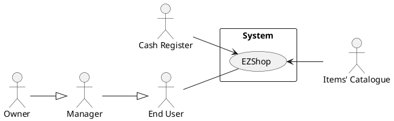

# Requirements Document 

Authors:

Date:

Version:

# Contents

- [Essential description](#essential-description)
- [Stakeholders](#stakeholders)
- [Context Diagram and interfaces](#context-diagram-and-interfaces)
	+ [Context Diagram](#context-diagram)
	+ [Interfaces](#interfaces) 
	
- [Stories and personas](#stories-and-personas)
- [Functional and non functional requirements](#functional-and-non-functional-requirements)
	+ [Functional Requirements](#functional-requirements)
	+ [Non functional requirements](#non-functional-requirements)
- [Use case diagram and use cases](#use-case-diagram-and-use-cases)
	+ [Use case diagram](#use-case-diagram)
	+ [Use cases](#use-cases)
    	+ [Relevant scenarios](#relevant-scenarios)
- [Glossary](#glossary)
- [System design](#system-design)
- [Deployment diagram](#deployment-diagram)

# Essential description

Small shops require a simple application to support the owner or manager. A small shop (ex a food shop) occupies 50-200 square meters, sells 500-2000 different item types, has one or a few cash registers.

EZShop is a software application to:
* manage sales
* manage inventory
* manage customers
* support accounting

# Stakeholders

| Stakeholder name  | Description | 
| ----------------- |:-----------:|
|   End User    | Uses the application to manage inventory, introduce sales, manage expenses, trace earnings        |
| Developer | Develops and maintain the application, introduce news feature to improve usability, fixes bugs
| Cash Register | ... |
| ... | ... |
# Context Diagram and interfaces

## Context Diagram

## Interfaces

| Actor | Logical Interface | Physical Interface  |
| ------------- |:-------------:| -----:|
|   End User    | GUI  | Touch Screen|
|  Items' Catalogue | Internet Connection | Web Services
| Cash register |  Internet Connection | Web Services
 

# Stories and personas
\<A Persona is a realistic impersonation of an actor. Define here a few personas and describe in plain text how a persona interacts with the system>

\<Persona is-an-instance-of actor>

#Anna
Anna is a 53 years old shop owner and manager. She is marryed and has a son, lives in Milan and is fond of travelling. She started her shop some years ago, but noticed she took too much time in sorting inventory and searching for what she should buy from suppliers. She then tried EZshop and even if she was not so confortable with applications, learned how to use it without much trouble. Now she doesn't only find immediatly what item her shop miss, but also check every morning the weekly account to find if sales are growing.

#Mark
Mark is a 28 years old shop manager in Munich. After he got his degree in economics and management he started working for a chain of small computer and electronic stores, but he doesn't own the shop. He is still new to his role as a manger and EZshop simplify a lot his work. The application helps him remember all the usual customer, the items he need to order from suppliers and which products are on sale. He will be also valued by his annual accounting, so he pays great actention in the weekly as well as the montly accounting. 

\<stories will be formalized later as scenarios in use cases>

# Functional and non functional requirements

## Functional Requirements

| ID        | Description  |
| ------------- |:-------------:| 
| FR1 | Authorize and authenticate |
| &nbsp;&nbsp;&nbsp;&nbsp;&nbsp;&nbsp;FR1.1 | Login user |
| &nbsp;&nbsp;&nbsp;&nbsp;&nbsp;&nbsp;FR1.2 | Logout user |
| &nbsp;&nbsp;&nbsp;&nbsp;&nbsp;&nbsp;FR1.3 | Sign up   |
| &nbsp;&nbsp;&nbsp;&nbsp;&nbsp;&nbsp;&nbsp;&nbsp;&nbsp;&nbsp;&nbsp;&nbsp;FR1.3.1 | Create account |
| &nbsp;&nbsp;&nbsp;&nbsp;&nbsp;&nbsp;&nbsp;&nbsp;&nbsp;&nbsp;&nbsp;&nbsp;FR1.3.2 | Associate account with new store |
| &nbsp;&nbsp;&nbsp;&nbsp;&nbsp;&nbsp;&nbsp;&nbsp;&nbsp;&nbsp;&nbsp;&nbsp;FR1.3.3 | Add manager |
| &nbsp;&nbsp;&nbsp;&nbsp;&nbsp;&nbsp;&nbsp;&nbsp;&nbsp;&nbsp;&nbsp;&nbsp;FR1.3.4 | Remove manager |
|  FR2     |  Manage Inventory |
|  &nbsp;&nbsp;&nbsp;&nbsp;&nbsp;&nbsp;FR2.1   |  Add new Item |
|  &nbsp;&nbsp;&nbsp;&nbsp;&nbsp;&nbsp;FR2.2 | Select Item |
|  &nbsp;&nbsp;&nbsp;&nbsp;&nbsp;&nbsp;&nbsp;&nbsp;&nbsp;&nbsp;&nbsp;&nbsp;FR2.2.1 |  Remove Item |
|  &nbsp;&nbsp;&nbsp;&nbsp;&nbsp;&nbsp;&nbsp;&nbsp;&nbsp;&nbsp;&nbsp;&nbsp;FR2.2.1 |  Update Item |
|  &nbsp;&nbsp;&nbsp;&nbsp;&nbsp;&nbsp;FR2.3 |  Read Item |
|  &nbsp;&nbsp;&nbsp;&nbsp;&nbsp;&nbsp;&nbsp;&nbsp;&nbsp;&nbsp;&nbsp;&nbsp;FR2.3.1 |  Find Item |
|  &nbsp;&nbsp;&nbsp;&nbsp;&nbsp;&nbsp;&nbsp;&nbsp;&nbsp;&nbsp;&nbsp;&nbsp;FR2.3.2 |  Filter Item |
|  &nbsp;&nbsp;&nbsp;&nbsp;&nbsp;&nbsp;&nbsp;&nbsp;&nbsp;&nbsp;&nbsp;&nbsp;FR2.3.3 |  Sort Item |
|  FR3     |  Manage Accounting |
| &nbsp;&nbsp;&nbsp;&nbsp;&nbsp;&nbsp;FR3.1 | Show daily accounting |
| &nbsp;&nbsp;&nbsp;&nbsp;&nbsp;&nbsp;FR3.2 | Show weekly accounting |
| &nbsp;&nbsp;&nbsp;&nbsp;&nbsp;&nbsp;FR3.3 | Show montly accounting |
| &nbsp;&nbsp;&nbsp;&nbsp;&nbsp;&nbsp;FR3.4 | Show annual accounting |
| &nbsp;&nbsp;&nbsp;&nbsp;&nbsp;&nbsp;FR3.5 | Add transaction |
| &nbsp;&nbsp;&nbsp;&nbsp;&nbsp;&nbsp;FR3.5.1 | Add expense |
| &nbsp;&nbsp;&nbsp;&nbsp;&nbsp;&nbsp;FR3.5.2 | Add income |
|  FR4     |  Manage Sales      |
|  &nbsp;&nbsp;&nbsp;&nbsp;&nbsp;&nbsp;FR4.1 | Scan item |
|  &nbsp;&nbsp;&nbsp;&nbsp;&nbsp;&nbsp;FR4.2 | Produce receipt  |
|  &nbsp;&nbsp;&nbsp;&nbsp;&nbsp;&nbsp;FR4.3 | remove item from receipt |
|  &nbsp;&nbsp;&nbsp;&nbsp;&nbsp;&nbsp;FR4.4 | return (reso) |
|  &nbsp;&nbsp;&nbsp;&nbsp;&nbsp;&nbsp;FR4.5 | provide coupon |
|  FR5   |  Manage Customer |
|  &nbsp;&nbsp;&nbsp;&nbsp;&nbsp;&nbsp;FR5.1 | fidelity card | 

## Non Functional Requirements

\<Describe constraints on functional requirements>

| ID        | Type (efficiency, reliability, ..)           | Description  | Refers to |
| ------------- |:-------------:| :-----:| -----:|
|  NFR1     | Efficiency(Space) | Inventory storage at least >2000 Item types | FR2 |
|  NFR2     | Efficiency(Performance) | Some operation shuold be executed in < 1sec | FR2.2, FR2.3 |
|  NFR3     | Usability | Training time must take < 20min | from FR1 to FR5 |
|  NFR4     | Usability | Trained person should take < 10sec for adding a new Item type | FR2.1 |
|  NFR5     | Interoperability | Some info must be saved also on cloud in case a user changes device | FR2, FR3, FR5 | 
|  NFR6     | Reliability | Manage sales function must be aviable even if no internet connection is aviable (?) | FR4 | 
|  NFR7     | Legislative | The system must check if the return is legally doable in the current situation (date, cupon/cash) | FR4.4/FR4.5 | 

# Use case diagram and use cases

## Use case diagram
\<define here UML Use case diagram UCD summarizing all use cases, and their relationships>

\<next describe here each use case in the UCD>
### Use case 1, UC1
| Actors Involved        |  |
| ------------- |:-------------:| 
|  Precondition     | \<Boolean expression, must evaluate to true before the UC can start> |  
|  Post condition     | \<Boolean expression, must evaluate to true after UC is finished> |
|  Nominal Scenario     | \<Textual description of actions executed by the UC> |
|  Variants     | \<other executions, ex in case of errors> |

##### Scenario 1.1 

\<describe here scenarios instances of UC1>

\<a scenario is a sequence of steps that corresponds to a particular execution of one use case>

\<a scenario is a more formal description of a story>

\<only relevant scenarios should be described>

| Scenario 1.1 | |
| ------------- |:-------------:| 
|  Precondition     | \<Boolean expression, must evaluate to true before the scenario can start> |
|  Post condition     | \<Boolean expression, must evaluate to true after scenario is finished> |
| Step#        | Description  |
|  1     |  |  
|  2     |  |
|  ...     |  |

##### Scenario 1.2

##### Scenario 1.x

### Use case 2, UC2
..

### Use case x, UCx
..

# Glossary

\<use UML class diagram to define important terms, or concepts in the domain of the system, and their relationships> 

\<concepts are used consistently all over the document, ex in use cases, requirements etc>

# System Design
\<describe here system design>

\<must be consistent with Context diagram>

# Deployment Diagram 

\<describe here deployment diagram >

