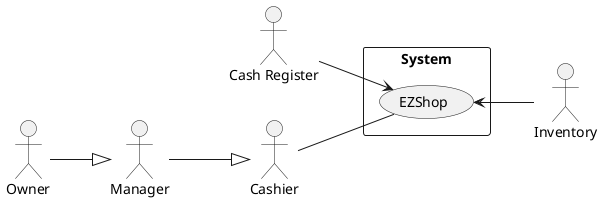
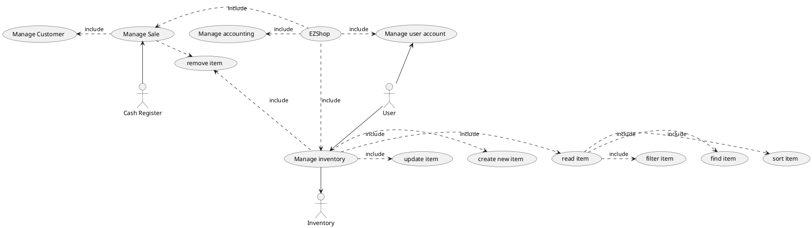
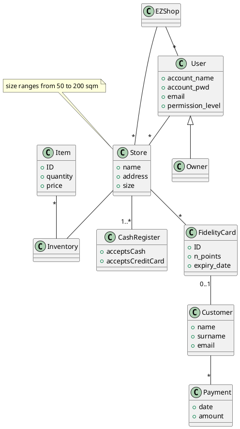
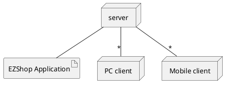

# Requirements Document 

Authors: Massimiliano Pronesti, Matteo Notarangelo, Davide Mammone, Umberto Pepato

Date:

Version:

# Contents

- [Essential description](#essential-description)
- [Stakeholders](#stakeholders)
- [Context Diagram and interfaces](#context-diagram-and-interfaces)
	+ [Context Diagram](#context-diagram)
	+ [Interfaces](#interfaces) 
	
- [Stories and personas](#stories-and-personas)
- [Functional and non functional requirements](#functional-and-non-functional-requirements)
	+ [Functional Requirements](#functional-requirements)
	+ [Non functional requirements](#non-functional-requirements)
- [Use case diagram and use cases](#use-case-diagram-and-use-cases)
	+ [Use case diagram](#use-case-diagram)
	+ [Use cases](#use-cases)
    	+ [Relevant scenarios](#relevant-scenarios)
- [Glossary](#glossary)
- [System design](#system-design)
- [Deployment diagram](#deployment-diagram)

# Essential description

Small shops require a simple application to support the owner or manager. A small shop (ex a food shop) occupies 50-200 square meters, sells 500-2000 different item types, has one or a few cash registers.

EZShop is a software application to:
* manage sales
* manage inventory
* manage customers
* support accounting

# Stakeholders

| Stakeholder name  | Description | 
| ----------------- |:-----------:|
|   Owner    | Uses the application to manage inventory, introduce sales, manage expenses, trace earnings        |
| Manager |  Uses the application to manage inventory, introduce sales, manages expenses, trace earnings on behalf of owner|
| Developer | Develops and maintain the application, introduce news feature to improve usability, fixes bugs
| Cashier | ... |
| Cash Register | ... |
| Inventory | ... |
# Context Diagram and interfaces

## Context Diagram

## Interfaces

| Actor | Logical Interface | Physical Interface  |
| ------------- |:-------------:| -----:|
|   End User    | Web GUI  | Touch Screen on Smartphone,keyboard and mouse on pc|
|  Inventory |  Web Services | Internet Connection |
| Cash register |  Web Services | Internet Connection |
 

# Stories and personas

## Anna

Anna is a 53 years old shop owner and manager. She is marryed and has a son, lives in Milan and is fond of travelling. She started her shop some years ago, but noticed she took too much time in sorting inventory and searching for what she should buy from suppliers. She then tried EZshop and even if she was not so confortable with applications, learned how to use it without much trouble. Now she doesn't only find immediatly what item her shop miss, but also check every morning the weekly account to find if sales are growing.

## Mark

Mark is a 28 years old shop manager in Munich. After he got his degree in economics and management he started working for a chain of small computer and electronic stores, but he doesn't own the shop. He is still new to his role as a manger and EZshop simplify a lot his work. The application helps him remember all the usual customer, the items he need to order from suppliers and which products are on sale. He will be also valued by his annual accounting, so he pays great actention in the weekly as well as the montly accounting. 

## Jean

Jean is a 23 years old cashier who works in a medium-size shop in Lyon. He has been foing this work for the past 2 years, but since his first day at work some thing as changed. Prior to the introduction of EZshop he used to take care of the different action related to sales mostly by himself, but nowadays the application greatly helps him. He has an account which he was given by the shop manager after a brief training on how to use the application. 

## Lucy

Lucy is a 36 years old shop owner in Glasgow, she owns a little tailor's shop and she is the only person working there, so she has to take care of the cash register. Because of this she is very busy and every little spare time is a great achivement, as such she uses all functions of EZshop application and especially like the inventory and sales features. 

# Functional and non functional requirements

## Functional Requirements

| ID        | Description  |
| ------------- |:-------------:| 
| FR1 | Authorize and authenticate |
| &nbsp;&nbsp;&nbsp;&nbsp;&nbsp;&nbsp;FR1.1 | Login user |
| &nbsp;&nbsp;&nbsp;&nbsp;&nbsp;&nbsp;FR1.2 | Logout user |
| &nbsp;&nbsp;&nbsp;&nbsp;&nbsp;&nbsp;FR1.3 | Sign up   |
| &nbsp;&nbsp;&nbsp;&nbsp;&nbsp;&nbsp;&nbsp;&nbsp;&nbsp;&nbsp;&nbsp;&nbsp;FR1.3.1 | Create account |
| &nbsp;&nbsp;&nbsp;&nbsp;&nbsp;&nbsp;&nbsp;&nbsp;&nbsp;&nbsp;&nbsp;&nbsp;FR1.3.2 | Associate account with new store |
| &nbsp;&nbsp;&nbsp;&nbsp;&nbsp;&nbsp;&nbsp;&nbsp;&nbsp;&nbsp;&nbsp;&nbsp;FR1.3.3 | Add or update User |
| &nbsp;&nbsp;&nbsp;&nbsp;&nbsp;&nbsp;&nbsp;&nbsp;&nbsp;&nbsp;&nbsp;&nbsp;FR1.3.4 | Remove User |
|  FR2     |  Manage Inventory |
|  &nbsp;&nbsp;&nbsp;&nbsp;&nbsp;&nbsp;FR2.1   |  Add or modify new Item |
|  &nbsp;&nbsp;&nbsp;&nbsp;&nbsp;&nbsp;FR2.2 |  Delete Item |
|  FR3 |  Read Item |
|  &nbsp;&nbsp;&nbsp;&nbsp;&nbsp;&nbsp;FR3.1 |  Find Item |
|  &nbsp;&nbsp;&nbsp;&nbsp;&nbsp;&nbsp;FR3.2 |  Filter Item |
|  &nbsp;&nbsp;&nbsp;&nbsp;&nbsp;&nbsp;FR3.3 |  Sort Item |
|  FR4     |  Manage Accounting |
| &nbsp;&nbsp;&nbsp;&nbsp;&nbsp;&nbsp;FR4.1 | Show daily accounting |
| &nbsp;&nbsp;&nbsp;&nbsp;&nbsp;&nbsp;FR4.2 | Show weekly accounting |
| &nbsp;&nbsp;&nbsp;&nbsp;&nbsp;&nbsp;FR4.3 | Show montly accounting |
| &nbsp;&nbsp;&nbsp;&nbsp;&nbsp;&nbsp;FR4.4 | Show annual accounting |
| &nbsp;&nbsp;&nbsp;&nbsp;&nbsp;&nbsp;FR4.5 | Add transaction |
| &nbsp;&nbsp;&nbsp;&nbsp;&nbsp;&nbsp;FR4.5.1 | Add expense |
| &nbsp;&nbsp;&nbsp;&nbsp;&nbsp;&nbsp;FR4.5.2 | Add income |
|  FR5     |  Manage Sales      |
|  &nbsp;&nbsp;&nbsp;&nbsp;&nbsp;&nbsp;FR5.1 | Scan item |
|  &nbsp;&nbsp;&nbsp;&nbsp;&nbsp;&nbsp;FR5.2 | Produce receipt  |
|  &nbsp;&nbsp;&nbsp;&nbsp;&nbsp;&nbsp;FR5.3 | remove item from receipt |
|  &nbsp;&nbsp;&nbsp;&nbsp;&nbsp;&nbsp;FR5.4 | return (reso) |
|  &nbsp;&nbsp;&nbsp;&nbsp;&nbsp;&nbsp;FR5.5 | provide coupon |
|  FR6   |  Manage Customer |
|  &nbsp;&nbsp;&nbsp;&nbsp;&nbsp;&nbsp;FR6.1 | fidelity card | 

## Non Functional Requirements

\<Describe constraints on functional requirements>

| ID        | Type (efficiency, reliability, ..)           | Description  | Refers to |
| ------------- |:-------------:| :-----:| -----:|
|  NFR1     | Space | Inventory should storage at least >2000 Item types | FR2 |
|  NFR2     | Performance | All function shuold be executed in < 1sec | All FR |
|  NFR3     | Usability | Training time should take < 20min | from FR1 to FR5 |
|  NFR4     | Usability | Trained person should take < 10sec for adding a new Item type | FR2.1 |
|  NFR5     | Interoperability | Some info should be saved also on cloud in case a user changes device | FR2, FR3, FR5 | 
|  NFR6     | Reliability | Manage sales function should be aviable even if no internet connection is aviable | FR4 | 
|  NFR7     | Legislative | The system should check if the return is legally doable in the current situation (date, cupon/cash) | FR4.4/FR4.5 | 
|  NFR8     | Localisation | The currrency is Euro | All FR | 
|  NFR9     | Privacy | Personal data of one user should not be accessed by other users and users with lower authentication level should not have access to higher authentication level function | All FR, especially FR1 | 
|  NFR10     | Portability | The application should be accessed by PC by major OS, and by smarthphone by Android and iOS | All FR | 

# Use case diagram and use cases

## Use case diagram

### Use case 1, UC1 - CREATE A USER ACCOUNT
use case 1, UC1 

| Actors Involved        | End user |
| ------------- |:-------------:| 
|  Precondition     | device is connected to the internet, application in ON |  
|  Post condition     | Existence of an account connected to the shop |
|  Nominal Scenario     | New user creates a new account U and populates its fields. |
|  Variants     | A user can create only one account, this is checked through the email (one email, one account at most). |

##### Scenario 1.1
| Scenario 1.1 | Nominal case |
| ------------- |:-------------:| 
|  Precondition     | device is connected to the internet, application in ON |
|  Post condition     | End user is logged in |
| Step#        | Description  |
|  1     | End user taps on login  |  
|  2     | End user inserts username and password |
|  3     | End user is logged in |

### Use case 2, UC2 - MODIFY USER ACCOUNT 

| Actors Involved        | End user |
| ------------- |:-------------:| 
|  Precondition     | Account user exists |  
|  Post condition     | - |
|  Nominal Scenario     | User modifies one or more fields of his account |
|  Variants     | A user can Modify only his/her account. a Manager can modify any account |

### Use case 3, UC3 - REMOVE USER ACCOUNT

| Actors Involved        | End user |
| ------------- |:-------------:| 
|  Precondition     | Account user exists |  
|  Post condition     | Account user deleted from the system |
|  Nominal Scenario     | User selects an account to delete |
|  Variants     | A user can delete only his/her account. a Manager can delete any account |

### Use case 4, UC4 - CREATE A NEW ITEM

| Actors Involved        | End user |
| ------------- |:-------------:| 
|  Precondition     | End user is logged in. Item does not exist |  
|  Post condition     | Item has been created |
|  Nominal Scenario     | the user creates a new item in the system; he enters all the fields of an item |

### Use case 5, UC5 - UPDATE ITEM 

| Actors Involved        | End user |
| ------------- |:-------------:| 
|  Precondition     | End user is logged in. Item exists |  
|  Post condition     | - |
|  Nominal Scenario     | User modifies one or more fields of the item |

### Use case 6, UC6 - DELETE ITEM

| Actors Involved        | End user |
| ------------- |:-------------:| 
|  Precondition     | Item exists |  
|  Post condition     | Item deleted from the system |
|  Nominal Scenario     | User selects an item to delete |

### Use case 7, UC7 - READ ITEM

| Actors Involved        | End user |
| ------------- |:-------------:| 
|  Precondition     | Items that user wants to read exist |  
|  Post condition     | Item has been read |
|  Nominal Scenario     | User selects one or more item to read |

##### Scenario 7.1
| Scenario 7.1 | filter case |
| ------------- |:-------------:| 
|  Precondition     | Items that user wants to filter exist |
|  Post condition     | Items have been filtered  |
| Step#        | Description  |
|  1     | End user opens the inventory |  
|  2     | End user filters items |

##### Scenario 7.2
| Scenario 7.2 | find case |
| ------------- |:-------------:| 
|  Precondition     | Items that user wants to find exist |
|  Post condition     | Items have been found |
| Step#        | Description  |
|  1     | End user opens the inventory |  
|  2     | End user finds the selected items |

##### Scenario 7.3
| Scenario 7.3 | sort case |
| ------------- |:-------------:| 
|  Precondition     | Items that user wants to sort exist |
|  Post condition     | Items have been sorted |
| Step#        | Description  |
|  1     | End user opens the inventory |  
|  2     | End user sorts items |

##### Scenario 7.4
| Scenario 7.4 | exeption case  (there's no item to read) |
| ------------- |:-------------:| 
|  Precondition     | Item that user wants  to read doesn't exist |
|  Post condition     | - |
| Step#        | Description  |
|  1     | End user opens the inventory |  
|  2     | End user tries to read items |
|  3     | App raises an error because there's no item to read telling the end user to add items first |

### Use case 8, UC8 - MANAGE SALES

| Actors Involved        | cash register, cashier |
| ------------- |:-------------:| 
|  Precondition     | there's a cashier at the cash register  |  
|  Post condition     | income is increased. one or more instances of the bought items has been removed from the catalogue (depending on how many instances of the same item is bought) |
|  Nominal Scenario     | cashier manages the sell of one or more items |
|  Variants     | customer can pay with cash (in case, he can have the right amount of money, or he can have less/more than needed) or with a CreditCard |

##### Scenario 8.1
| Scenario 8.1 | Nominal case |
| ------------- |:-------------:| 
|  Precondition     |scan is valid |
|  Post condition     | items has been selled |
|        |   income has increased    |
|        |   quantity of item in inventory is reduced   |
| Step#        | Description  |
|  1     | cashier scans item 1 |  
|  2     | cashier scans item 2 |
|  ..    | until last item |
|  3     | customer pays the correct amount |
|  4     | cashier inserts money in the cash register |
|  5     | cash register prints the receipt |
|  6     | cashier gives the receipt to the customer |
|  7     | cashier provides coupon to the customer |

### Use case 9, UC9 - MANAGE CUSTOMER

| Actors Involved        | Cashier |
| ------------- |:-------------:| 
|  Precondition     | Customer has a fidelity card |  
|       | Cashier has already printed the receipt | 
|  Post condition     | - |
|  Nominal Scenario     | Cashier provides coupon to the customer (depending on how much he/her has spent) |

# Glossary

# System Design
\<describe here system design>

\<must be consistent with Context diagram>

# Deployment Diagram 

