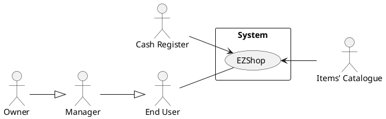

# Requirements Document 

Authors:

Date:

Version:

# Contents

- [Essential description](#essential-description)
- [Stakeholders](#stakeholders)
- [Context Diagram and interfaces](#context-diagram-and-interfaces)
	+ [Context Diagram](#context-diagram)
	+ [Interfaces](#interfaces) 
	
- [Stories and personas](#stories-and-personas)
- [Functional and non functional requirements](#functional-and-non-functional-requirements)
	+ [Functional Requirements](#functional-requirements)
	+ [Non functional requirements](#non-functional-requirements)
- [Use case diagram and use cases](#use-case-diagram-and-use-cases)
	+ [Use case diagram](#use-case-diagram)
	+ [Use cases](#use-cases)
    	+ [Relevant scenarios](#relevant-scenarios)
- [Glossary](#glossary)
- [System design](#system-design)
- [Deployment diagram](#deployment-diagram)

# Essential description

Small shops require a simple application to support the owner or manager. A small shop (ex a food shop) occupies 50-200 square meters, sells 500-2000 different item types, has one or a few cash registers.

EZShop is a software application to:
* manage sales
* manage inventory
* manage customers
* support accounting

# Stakeholders

| Stakeholder name  | Description | 
| ----------------- |:-----------:|
|   End User    | Uses the application to manage inventory, introduce sales, manage expenses, trace earnings        |
| Developer | Develops and maintain the application, introduce news feature to improve usability, fixes bugs
| Cash Register | ... |
| ... | ... |
# Context Diagram and interfaces

## Context Diagram

## Interfaces

| Actor | Logical Interface | Physical Interface  |
| ------------- |:-------------:| -----:|
|   End User    | GUI  | Touch Screen|
|  Items' Catalogue | Internet Connection | Web Services
| Cash register |  Internet Connection | Web Services
 

# Stories and personas
\<A Persona is a realistic impersonation of an actor. Define here a few personas and describe in plain text how a persona interacts with the system>

\<Persona is-an-instance-of actor>

\<stories will be formalized later as scenarios in use cases>

# Functional and non functional requirements

## Functional Requirements

| ID        | Description  |
| ------------- |:-------------:| 
| FR1 | Authorize and authenticate |
| &nbsp;&nbsp;&nbsp;&nbsp;&nbsp;&nbsp;FR1.1 | Login user |
| &nbsp;&nbsp;&nbsp;&nbsp;&nbsp;&nbsp;FR1.2 | Logout user |
| &nbsp;&nbsp;&nbsp;&nbsp;&nbsp;&nbsp;FR1.3 | Sign up   |
| &nbsp;&nbsp;&nbsp;&nbsp;&nbsp;&nbsp;&nbsp;&nbsp;&nbsp;&nbsp;&nbsp;&nbsp;FR1.3.1 | Create account |
| &nbsp;&nbsp;&nbsp;&nbsp;&nbsp;&nbsp;&nbsp;&nbsp;&nbsp;&nbsp;&nbsp;&nbsp;FR1.3.2 | Associate account with new store |
| &nbsp;&nbsp;&nbsp;&nbsp;&nbsp;&nbsp;&nbsp;&nbsp;&nbsp;&nbsp;&nbsp;&nbsp;FR1.3.3 | Add manager |
| &nbsp;&nbsp;&nbsp;&nbsp;&nbsp;&nbsp;&nbsp;&nbsp;&nbsp;&nbsp;&nbsp;&nbsp;FR1.3.4 | Remove manager |
|  FR2     |  Manage Inventory |
|  &nbsp;&nbsp;&nbsp;&nbsp;&nbsp;&nbsp;FR2.1   |  Add new Item |
|  &nbsp;&nbsp;&nbsp;&nbsp;&nbsp;&nbsp;FR2.2 | Select Item |
|  &nbsp;&nbsp;&nbsp;&nbsp;&nbsp;&nbsp;&nbsp;&nbsp;&nbsp;&nbsp;&nbsp;&nbsp;FR2.2.1 |  Remove Item |
|  &nbsp;&nbsp;&nbsp;&nbsp;&nbsp;&nbsp;&nbsp;&nbsp;&nbsp;&nbsp;&nbsp;&nbsp;FR2.2.1 |  Update Item |
|  &nbsp;&nbsp;&nbsp;&nbsp;&nbsp;&nbsp;FR2.3 |  Read Item |
|  &nbsp;&nbsp;&nbsp;&nbsp;&nbsp;&nbsp;&nbsp;&nbsp;&nbsp;&nbsp;&nbsp;&nbsp;FR2.3.1 |  Find Item |
|  &nbsp;&nbsp;&nbsp;&nbsp;&nbsp;&nbsp;&nbsp;&nbsp;&nbsp;&nbsp;&nbsp;&nbsp;FR2.3.2 |  Filter Item |
|  &nbsp;&nbsp;&nbsp;&nbsp;&nbsp;&nbsp;&nbsp;&nbsp;&nbsp;&nbsp;&nbsp;&nbsp;FR2.3.3 |  Sort Item |
|  FR3     |  Manage Accounting |
| &nbsp;&nbsp;&nbsp;&nbsp;&nbsp;&nbsp;FR3.1 | Show daily accounting |
| &nbsp;&nbsp;&nbsp;&nbsp;&nbsp;&nbsp;FR3.2 | Show weekly accounting |
| &nbsp;&nbsp;&nbsp;&nbsp;&nbsp;&nbsp;FR3.3 | Show montly accounting |
| &nbsp;&nbsp;&nbsp;&nbsp;&nbsp;&nbsp;FR3.4 | Show annual accounting |
| &nbsp;&nbsp;&nbsp;&nbsp;&nbsp;&nbsp;FR3.5 | Add transaction |
| &nbsp;&nbsp;&nbsp;&nbsp;&nbsp;&nbsp;FR3.5.1 | Add expense |
| &nbsp;&nbsp;&nbsp;&nbsp;&nbsp;&nbsp;FR3.5.2 | Add income |
|  FR4     |  Manage Sales      |
|  &nbsp;&nbsp;&nbsp;&nbsp;&nbsp;&nbsp;FR4.1 | Scan item |
|  &nbsp;&nbsp;&nbsp;&nbsp;&nbsp;&nbsp;FR4.2 | Produce receipt  |
|  &nbsp;&nbsp;&nbsp;&nbsp;&nbsp;&nbsp;FR4.3 | remove item from receipt |
|  &nbsp;&nbsp;&nbsp;&nbsp;&nbsp;&nbsp;FR4.4 | return (reso) |
|  &nbsp;&nbsp;&nbsp;&nbsp;&nbsp;&nbsp;FR4.5 | provide coupon |
|  FR5   |  Manage Customer |
|  &nbsp;&nbsp;&nbsp;&nbsp;&nbsp;&nbsp;FR5.1 | fidelity card | 

## Non Functional Requirements

\<Describe constraints on functional requirements>

| ID        | Type (efficiency, reliability, ..)           | Description  | Refers to |
| ------------- |:-------------:| :-----:| -----:|
|  NFR1     |   |  | |
|  NFR2     | |  | |
|  NFR3     | | | |
| NFRx .. | | | | 

# Use case diagram and use cases

## Use case diagram
### Use case 1, UC1
use case 'Authorize and authenticate' UC1
| Actors Involved        | End user |
| ------------- |:-------------:| 
|  Precondition     | device is connected to the internet, application in ON |  
|  Post condition     | (Existence of an account connected to the shop?) |
|  Nominal Scenario     | \<Textual description of actions executed by the UC> |
|  Variants     | \<other executions, ex in case of errors> |

##### Scenario 1.1 

\<describe here scenarios instances of UC1>

\<a scenario is a sequence of steps that corresponds to a particular execution of one use case>

\<a scenario is a more formal description of a story>

\<only relevant scenarios should be described>

| Scenario 1.1 | Nominal case |
| ------------- |:-------------:| 
|  Precondition     | device is connected to the internet, application in ON |
|  Post condition     | End user is logged in |
| Step#        | Description  |
|  1     | End user taps on login  |  
|  2     | End user inserts username and password |
|  3     | End user is logged in |

##### Scenario 1.2

| Scenario 1.2 | first time opening the app |
| ------------- |:-------------:| 
|  Precondition     | device is connected to the internet, application in ON |
|  Post condition     | End user has created an account associated to the shop he manages |
| Step#        | Description  |
|  1     | End user taps on sign in  |  
|  2     | End user chooses username and password |
|  3     | End user creates an account |
|  4     | End user associates the new account to the shop he manages |
##### Scenario 1.3
| Scenario 1.3 | exception case | 
| ------------- |:-------------:| 
|  Precondition     | device is NOT connected to the internet, application in ON  |
|  Post condition     | End user is not logged in |
| Step#        | Description  |
|  1     | End user taps on login  |  
|  2     | End user inserts username and password |
|  3     | Application cannot verify the validity of the account?? |
|  4     | Application raises an error |
### Use case 2, UC2
..

### Use case x, UCx
..

# Glossary

\<use UML class diagram to define important terms, or concepts in the domain of the system, and their relationships> 

\<concepts are used consistently all over the document, ex in use cases, requirements etc>

# System Design
\<describe here system design>

\<must be consistent with Context diagram>

# Deployment Diagram 

\<describe here deployment diagram >

